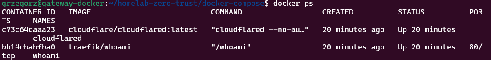
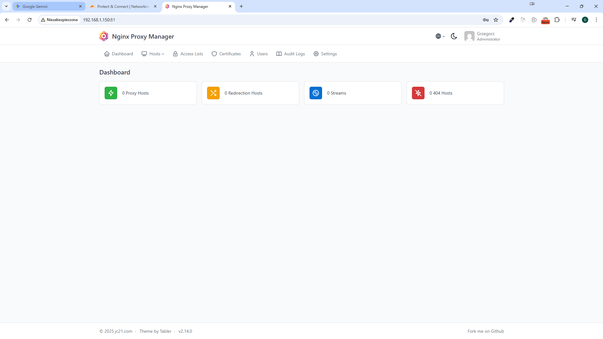
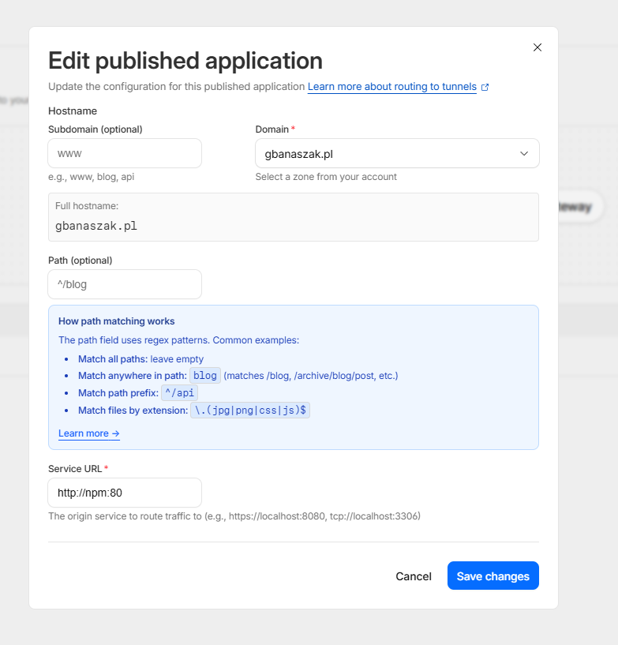
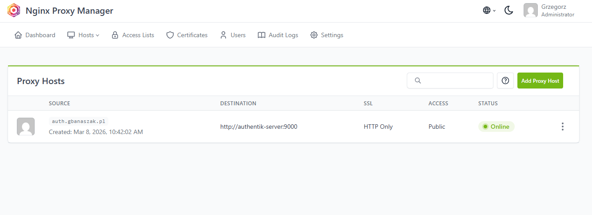
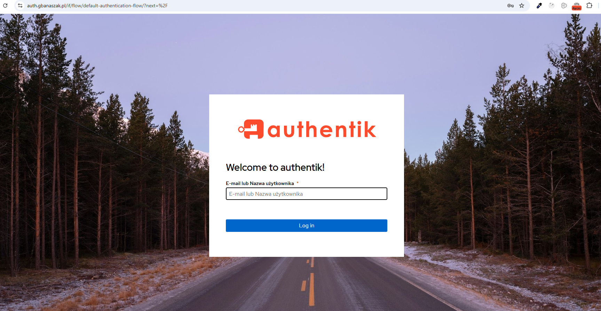
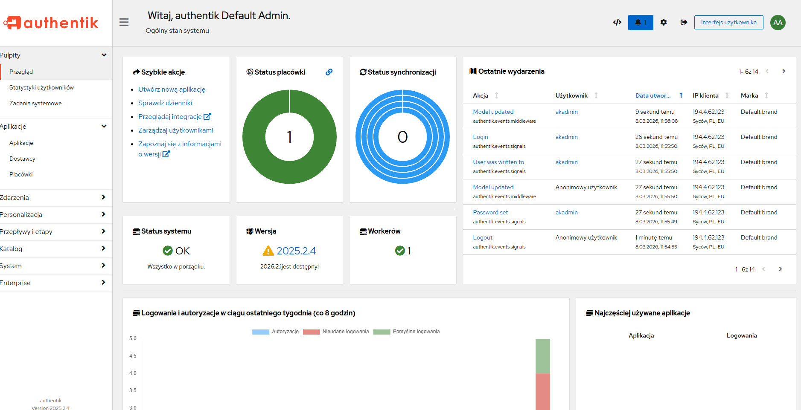
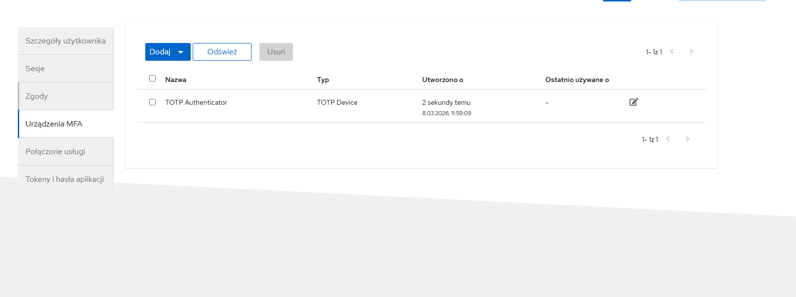
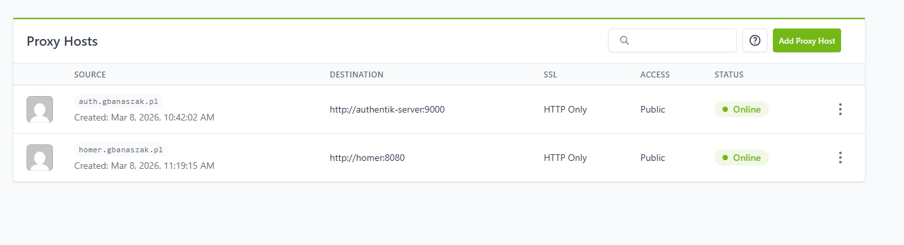
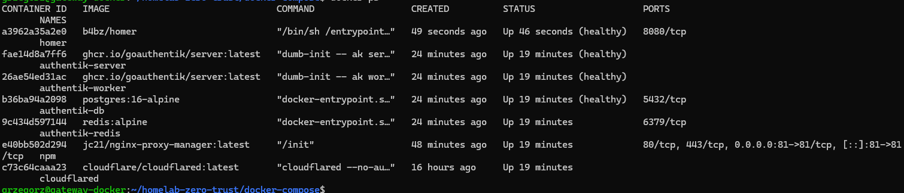

# Case Study: Bezpieczna Publikacja Usług (Zero Trust, Cloudflare Tunnels & SSO)

## 📌 Cel projektu

Celem projektu było zaprojektowanie i wdrożenie bezpiecznej architektury dla usług utrzymywanych w środowisku Home Lab (Proxmox VE), umożliwiającej dostęp z dowolnego miejsca na świecie.

Głównym wyzwaniem technologicznym był brak publicznego adresu IP (połączenie z internetem przez operatora stosującego CGNAT/internet radiowy). Dodatkowo, architektura musiała spełniać założenia modelu **Zero Trust**, wymuszając uwierzytelnianie wieloskładnikowe (MFA) dla każdej usługi – nawet dla tych, które natywnie nie posiadają panelu logowania.

## 🛠 Wykorzystany Tech Stack

- **Infrastruktura:** Proxmox VE -> Ubuntu Server 24.04 LTS (VM dedykowana jako Gateway)
- **Kompilacja i Orkiestracja:** Docker & Docker Compose
- **Zarządzanie ruchem brzegowym:** Cloudflare Tunnels (`cloudflared`)
- **Reverse Proxy / Ingress:** Nginx Proxy Manager (NPM)
- **Identity Provider (IdP) & SSO:** Authentik (korzystający z PostgreSQL i Redis)
- **Aplikacja testowa:** Homer (Dashboard)

---

## 🏗 Architektura i Przepływ Ruchu

Zrezygnowano z tradycyjnego podejścia (przekierowanie portów na routerze i wystawienie usług na portach 80/443) na rzecz bezpiecznego, szyfrowanego tunelu wychodzącego.

**Przepływ żądania HTTP/HTTPS:**

1. **Request:** Użytkownik łączy się z adresem `https://homer.gbanaszak.pl`.
2. **Edge Network:** Ruch trafia na serwery brzegowe Cloudflare (gdzie aplikowany jest certyfikat SSL i podstawowy WAF).
3. **Szyfrowany Tunel:** Żądanie przesyłane jest przez Cloudflare Tunnel do demona `cloudflared` działającego w mojej sieci lokalnej. **Żadne porty wejściowe (Inbound) nie są otwarte na firewallu domowym.**
4. **Reverse Proxy:** `cloudflared` przekazuje ruch wewnętrznie do Nginx Proxy Managera (NPM).
5. **Forward Authentication (MFA Check):** NPM zatrzymuje żądanie i weryfikuje u usługi Authentik, czy użytkownik posiada ważną sesję.
   - _Brak sesji:_ Użytkownik jest przekierowywany na stronę logowania `auth.gbanaszak.pl` i musi podać login, hasło oraz kod TOTP.
   - _Sesja ważna:_ Authentik wydaje polecenie przepuszczenia ruchu.
6. **Dostęp do usługi:** Nginx przekazuje ruch do właściwego kontenera (Homer), który natywnie nie posiada żadnych zabezpieczeń.

---

## 🛡 Kluczowe Rozwiązania i Rozwiązywanie Problemów

Podczas wdrożenia zmierzyłem się z kilkoma rzeczywistymi problemami inżynieryjnymi, które z powodzeniem rozwiązałem:

### 1. Ominięcie CGNAT (Carrier-grade NAT)

Z powodu braku publicznego adresu IP, standardowa usługa DDNS i Port Forwarding były niemożliwe do zastosowania. Wdrożyłem **Cloudflare Zero Trust Tunnels**, łącząc moją sieć z chmurą za pomocą agenta, co całkowicie zamaskowało moje publiczne IP (ochrona przed skanowaniem portów i atakami DDoS).

### 2. Forward Authentication dla aplikacji "Legacy"

Wdrożyłem aplikację _Homer_, która domyślnie jest całkowicie otwarta. Dzięki zastosowaniu oficjalnych skryptów integrujących Authentik z blokami `location` w Nginx Proxy Managerze, nałożyłem globalną warstwę SSO i MFA. Żaden pakiet nie dotrze do kontenera docelowego bez weryfikacji tożsamości.

### 3. Debugowanie środowisk Linux / Docker

- Zdiagnozowałem i naprawiłem problem z brakiem łączności zewnętrznej maszyny wirtualnej, modyfikując pliki konfiguracyjne **Netplan** (dodanie serwerów DNS dla statycznego IP).
- Rozwiązałem problem z błędami uprawnień (`Permission denied`) podczas inicjalizacji kontenera Authentik Worker. Kontener (ze względów bezpieczeństwa) działał jako użytkownik niebędący rootem. Użyłem polecenia `chown -R 1000:1000` na zamontowanych wolumenach (Volumes) na hoście, dostosowując uprawnienia do wymogów bezpieczeństwa Dockera.

---

## 📸 Dokumentacja Wizualna (Proof of Work)

Poniżej przedstawiam kluczowe etapy zrealizowanego wdrożenia. Ze względu na obszerną dokumentację zdjęciową, zrzuty ekranu zostały pogrupowane i ukryte w rozwijanych sekcjach – kliknij w wybrany etap, aby zobaczyć szczegóły.

<b>1. Konfiguracja Cloudflare Tunnels i testowanie łączności</b>

**Krok 1:** Utworzenie nowego tunelu w panelu Cloudflare Zero Trust:

**Krok 2:** Weryfikacja statusu i szczegółów utworzonego tunelu:

**Krok 3:** Uruchomienie pierwszych kontenerów (agent `cloudflared` oraz testowa aplikacja `whoami`):

**Krok 4:** Pomyślny test połączenia z kontenerem `whoami` przez wystawiony tunel:

<b>2. Uruchomienie i konfiguracja Nginx Proxy Manager (NPM)</b>

**Krok 1:** Utworzenie i uruchomienie instancji Nginx Proxy Managera:

**Krok 2:** Konfiguracja proxy hostów i reguł przekierowań w panelu NPM:

<b>3. Wdrożenie Identity Provider (Authentik)</b>

**Krok 1:** Konfiguracja rekordów DNS dla usług Authentik w panelu Cloudflare (część 1):

**Krok 2:** Konfiguracja rekordów DNS dla usług Authentik (część 2):

**Krok 3:** Pierwsze logowanie do panelu administracyjnego Authentik:

**Krok 4:** Konfiguracja początkowa dostawcy tożsamości:

<b>4. Wdrożenie i konfiguracja weryfikacji dwuetapowej (MFA/TOTP)</b>

**Krok 1:** Konfiguracja przepływu (flow) dla uwierzytelniania wieloskładnikowego:

**Krok 2:** Przypisanie i weryfikacja aplikacji autentykującej (TOTP):

**Krok 3:** Udane logowanie przy użyciu drugiego składnika:

<b>5. Ochrona aplikacji docelowej (Home Dashboard) za pomocą SSO</b>

**Krok 1:** Utworzenie nowej aplikacji (Homer) i dostawcy uwierzytelniania (Provider) w Authentik:

**Krok 2:** Powiązanie utworzonej aplikacji ze strumieniem logowania (Outpost):

**Krok 3:** Dostęp do panelu Homer zabezpieczonego warstwą autoryzacji SSO:

<b>6. Podsumowanie środowiska Docker</b>

Widok wszystkich uruchomionych i współpracujących ze sobą kontenerów Docker w ramach wdrożonej architektury Zero Trust:

